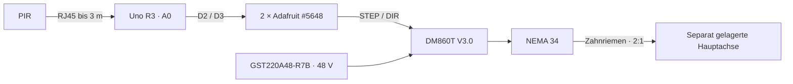

# Halloween-Spinne

Eine etwa 5 kg schwere Spinne auf Rollen bewegt sich langsam auf einer Kreisbahn. Ein PIR löst die Fahrt aus. Der Arduino steuert einen NEMA-34-Schrittmotor; ein Zahnriemen überträgt die Bewegung auf eine separat gelagerte Hauptachse und das ungefähr 1 m lange Zugrohr.

**Stand 03.10.2026 · Revision B: fertige Module, keine selbst gelötete Zusatzplatine. Entwurf noch nicht aufgebaut oder getestet; Firmware folgt als nächster Arbeitsschritt.**

## Aktuelle Konfiguration

| Funktion | Gerät |
|---|---|
| Steuerung | Vorhandener Arduino Uno R3 |
| Bewegungserkennung | Vorhandener PIR in HC-SR501-Bauform, RJ45-Patchkabel bis 3 m |
| Steckbare Anschlüsse | DFRobot IO Expansion Shield DFR0265 auf dem Uno |
| STEP/DIR-Schnittstelle | 2 × Adafruit MOSFET Driver #5648 plus 2 × STEMMA-Kabel #3894 |
| Motortreiber | STEPPERONLINE DM860T **V3.0**, auf 5-V-Signale eingestellt |
| Motor | STEPPERONLINE 34HS46-6004S1, NEMA 34, mit 1-m-Kabel |
| Motorversorgung | Geschlossenes Mean Well GST220A48-R7B, 48 V / 4,6 A |
| Arduino-Versorgung | Separates USB-Netzteil und USB-A/B-Datenkabel |
| Gemeinsames Einschalten | Vorhandene Schweizer Mehrfachsteckdose S0 |

Alle Platinen werden fertig bestückt gekauft. Es bleiben Kabelstecken, Ablängen, Abisolieren und Klemmen. Zusätzliche einzelne Widerstände oder eine Lötplatine sind nicht erforderlich. Das fertig konfektionierte DC-Verlängerungskabel wird nur an seinem treiberseitigen Ende gekürzt. Netzteil und dessen eigenes Kabel bleiben unverändert. Beide Netzteile werden mit fertigen Netzanschlüssen in die Mehrfachsteckdose gesteckt.

Für die Gehäuseplanung ist zunächst ein **trockener, geschützter Standort** angenommen; dieser ist noch nicht bestätigt. Kabeldurchführungen und Befestigungsmittel müssen nach den realen Kabelmaßen gewählt werden. Die Bestellung von Gehäuseteilen ist deshalb getrennt von der festgelegten Elektronik geführt.

**Beschaffung:** Schweizer Händler oder Amazon bevorzugt; DigiKey und Farnell ausgeschlossen. Die fehlenden Teile sollen binnen einer Woche in der Schweiz eintreffen. Die [Bestellliste](bom/bestellliste.md) nennt konkrete Angebote und offene Bezugsquellen. Module bei Play-Zone und Shield/RJ45-Adapter bei Bastelgarage sind vorgesehen. Für Antrieb, Motornetzteil und spezielle Anschlusskabel ist die Wochenlieferung noch nicht belegt; die Gesamtbeschaffung bleibt offen.

## Dokumente

| Dokument | Inhalt |
|---|---|
| [Fertige Module](docs/fertige-module.md) | Auswahl, Alternativen und Beschaffungsgrenzen |
| [Elektronik und Schaltpläne](docs/elektronik.md) | Maßgebliche Pinliste, zwei grafische Blätter und Aufbaufolge |
| [Material-Stückliste](bom/material-stueckliste.md) | Alle Elektronikteile, Zweck und bestätigter Bestand |
| [Bestellliste](bom/bestellliste.md) | Fehlende Teile, Lieferanten und offene Zubehörmaße |
| [Firmware-Anforderungen](docs/firmware.md) | Neuer Pinvertrag und Ablauf; noch keine Implementierung |
| [Inbetriebnahme](docs/inbetriebnahme.md) | Mess- und Funktionsprüfungen vor dem Lastbetrieb |
| [Quellen und Entscheidungen](docs/quellen-und-entscheidungen.md) | Herstellerunterlagen und technische Begründungen |
| [Mechanik](docs/mechanik.md) | Projektkontext, kein aktueller Beschaffungsumfang |
| [Hauptwelle](docs/hauptwelle-auslegung.md) | Vorprüfung 15/20 mm, noch keine endgültige Dimensionierung |
| [AGENTS.md](AGENTS.md) | Arbeitsregeln für Coding-Agents |
| [Historische Revision A](docs/archiv/revision-a/README.md) | Überholter Lötentwurf und Recherche |
| [Ursprüngliches Handover](docs/archiv/PROJECT_HANDOFF_Halloween_Spider.md) | Historisches Quellenmaterial |

## Betrieb und nächste Schritte

Startposition bei ausgeschalteter Motorversorgung manuell einrichten. Einschalten → 60 s PIR-Anlaufzeit → mindestens 500 ms LOW → neue Bewegung → langsame Vorfahrt → Pause → Rückfahrt → Cooldown. Kein Home-Sensor und kein Freigabeschalter. Nach Schrittverlust oder Versorgungsausfall ist die Position unbekannt.

Als nächstes: festgelegte Elektronik beschaffen, Kabelmaße/Gehäuse festlegen, Firmware entwickeln und zunächst ohne Rohr und Wagen testen. Die Dokumentprüfung ersetzt keinen Hardwaretest. S0 ist eine gemeinsame Netzabschaltung, kein zertifizierter Not-Halt. Der Bewegungsbereich und der Riemenantrieb müssen vor Zugriff geschützt sein.
