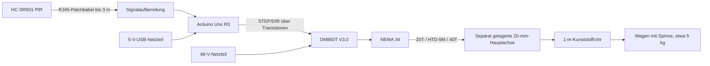

# Halloween-Spinne

Eine große Halloween-Spinne fährt auf einem Wagen mit sechs kugelgelagerten Rollen. Ein ungefähr ein Meter langes Kunststoffrohr zieht und schiebt den Wagen auf einer Kreisbahn. Ein PIR-Bewegungsmelder löst eine langsame, beschleunigte und wieder abgebremste Bewegungssequenz aus.

**Stand: 3. Oktober 2026 · Umstellung auf fertige Module · noch nicht aufgebaut oder elektrisch getestet.**

**Neue Vorgabe vom 03.10.2026: Aufbau mit fertig bestückten Modulen, ohne selbst gelötete Zusatzplatine. Der folgende Rev.-A-Entwurf ist ein historischer Zwischenstand und noch keine Bestell- oder Aufbauempfehlung für die neue Ausführung. Controller, Versorgung und Anschlussplan werden gemeinsam neu ausgewählt.**

## Projektstand

Vorhanden sind laut Bestätigung vom 26.09.2026 **Arduino Uno R3 (E01), PIR-Modul (E02), Patchkabel (E08) und CH-Mehrfachsteckdose (E28)**. Am **03.10.2026** nochmals bestätigt: noch nichts bestellt; Motor, Treiber, Netzteile und weitere Elektronik sind noch zu beschaffen. Der aktuelle Arbeitsumfang sowie die Material- und Bestellliste umfassen die Elektronik sowie die ausdrücklich ergänzte Motorhalterung ST-M7 (E47). Der PIR entspricht optisch einem HC-SR501; die tatsächliche Anschlussbeschriftung ist vor dem Verdrahten zu prüfen.

Die bisherige Rev. A beschreibt den Aufbau mit einer selbst gelöteten Schnittstellenplatine. Sie erfüllt die neue Vorgabe nicht und wird ersetzt. Eine funktionierende Gesamtanlage benötigt zusätzlich die noch zu entwickelnde Firmware und die Inbetriebnahmeprüfungen. Insbesondere ist dies keine bereits erprobte Bauanleitung.

## Dokumente

| Dokument | Inhalt |
|---|---|
| [Fertige Module: Vorauswahl](docs/fertige-module.md) | Konkrete Alternativen ohne eigene Lötplatine, Anschlusskonzept, Schweizer Preise und noch offene Punkte |
| [Elektronik und Schaltplan](docs/elektronik.md) | Zwei grafische Schaltplanblätter, sämtliche Verbindungen, Lötaufbau und Treibereinstellungen |
| [Material-Stückliste](bom/material-stueckliste.md) | Elektronik, elektrisches Zubehör, Mengen, Begründung und Bestand |
| [Bestellliste](bom/bestellliste.md) | Fehlende Elektronik mit Lieferanten und konkreten Auswahlmerkmalen |
| [Mechanik](docs/mechanik.md) | Riemenantrieb, Lagerung, Befestigung und noch zu messende Maße |
| [Hauptwelle: 15 oder 20 mm](docs/hauptwelle-auslegung.md) | Rechnerische Vorprüfung, Einfluss des Riemenüberhangs und offene Maße |
| [Firmware-Anforderungen](docs/firmware.md) | Pinbelegung, Zustände und Bewegungsparameter; noch keine Implementierung |
| [Inbetriebnahme](docs/inbetriebnahme.md) | Prüfungen vom spannungslosen Aufbau bis zum Wagen |
| [Quellen und Entscheidungen](docs/quellen-und-entscheidungen.md) | Datenblätter und Abweichungen vom frühen Handover |
| [AGENTS.md](AGENTS.md) | Arbeitskontext für Coding-Agents |
| [Ursprüngliches Handover](docs/archiv/PROJECT_HANDOFF_Halloween_Spider.md) | Unveränderte historische Quelle; neuere Dokumente haben Vorrang |

## Bisheriger Aufbau Rev. A

Das Gewicht liegt auf den Rollen. Der Motor muss Rollwiderstand und Beschleunigung überwinden; er trägt nicht die Spinne an einem frei schwebenden Hebel. Seine Welle trägt nur die motorseitige Riemenscheibe.

## Bisherige Referenzausführung Rev. A

- Motor: STEPPERONLINE **34HS46-6004S1**, NEMA 34, 14-mm-Welle.
- Treiber: **DM860T**, dieser Plan bezieht sich ausdrücklich auf **V3.0**.
- Motorversorgung: **Mean Well LRS-350-48**, 48 V; Uno separat über USB.
- Netzanschluss Schweiz: beide Netzteile an derselben geschalteten **CH-Mehrfachsteckdose S0**; Motornetzteil über W1 mit Typ-12-Stecker, USB-Netzteil direkt eingesteckt.
- Mechanik: **20T : 40T**, **HTD-5M**, **15 mm** Riemenbreite, vorläufig **450-5M-15**.
- Hauptachse: Stahl, zwei Lager; 20 mm als vorläufige Referenz, 15 mm als noch zu dimensionierende Alternative.
- Trigger: vorhandener PIR, vier Adern in zwei Paaren eines RJ45-Patchkabels bis 3 m; drei elektrische Netze: 5 V, GND, OUT.
- Kein Hall-Sensor und keine automatische Referenzfahrt in der ersten Version.

Modellwerte und Quellen stehen in [Elektronik](docs/elektronik.md) und [Quellen](docs/quellen-und-entscheidungen.md). Haltemoment ist kein Nachweis für das verfügbare Drehmoment während der Fahrt.

## Geplanter Ablauf

Einschalten → 60 s Sensor-Anlaufzeit → PIR-LOW abwarten → auf neue Bewegung warten → langsam vorfahren → Pause → zurückfahren → Cooldown → erneut scharf werden, wenn der PIR wieder LOW war.

Die Ausgangsposition wird vor dem Einschalten bei ausgeschalteter Motorversorgung manuell festgelegt. Nach jedem Einschalten oder Arduino-Reset wird die Steuerung automatisch wieder bereit; es gibt keinen Freigabeschalter. Nach Stromausfall, Blockade oder Schrittverlust ist sie unbekannt und muss neu eingerichtet werden. Die ersten Versuche erfolgen ohne Arm und Wagen.

## Grenzen des Entwurfs

Der 230-V-Teil wird geklemmt/gecrimpt und durch eine Elektrofachperson aufgebaut und geprüft. Die Lötanleitung betrifft die Kleinspannungsplatinen. Schwenkbereich und Riemenantrieb müssen gegen Zugriff geschützt sein. Der vorgesehene Hauptschalter ist eine Netzabschaltung, kein nachgewiesener Not-Halt. Eine sofortige mechanische Stillsetzung ist damit nicht zugesichert.

Die bestehenden Mechanikdokumente bleiben als Projektkontext erhalten. Die Motorhalterung ST-M7 (E47) ist auf ausdrücklichen Wunsch in der Material- und Bestellliste enthalten. Weitere Konstruktion und mechanische Beschaffung gehören nicht zum Umfang dieser Listen.
