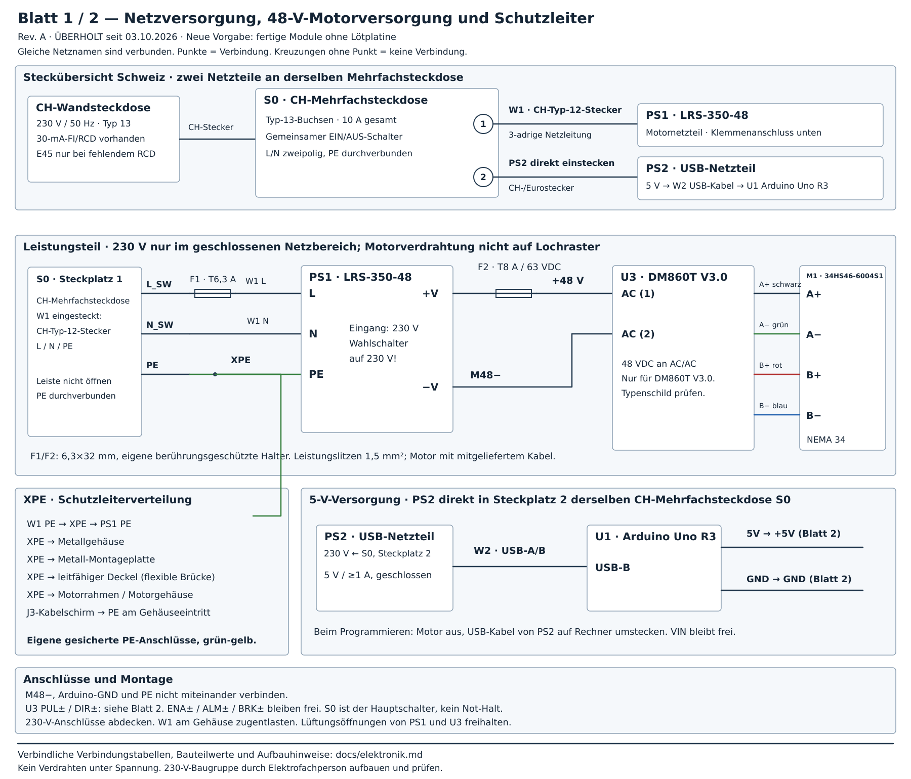
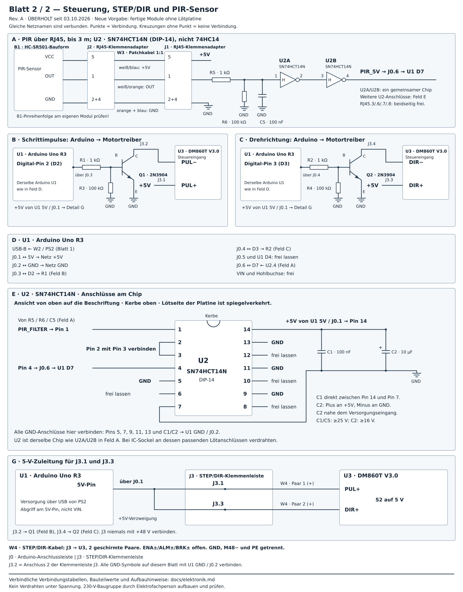

# Elektronik, Schaltplan und Verdrahtung

**Neue Vorgabe vom 03.10.2026: Aufbau mit fertig bestückten Modulen, ohne selbst gelötete Zusatzplatine. Der folgende Rev.-A-Entwurf ist ein historischer Zwischenstand und noch keine Bestell- oder Aufbauempfehlung für die neue Ausführung. Controller, Versorgung und Anschlussplan werden gemeinsam neu ausgewählt.**

**Revision A · 26.09.2026 · Schaltungsentwurf, noch kein getesteter Aufbau.**

Der Plan gilt für **U1 Arduino Uno R3**, **B1 HC-SR501-kompatiblen PIR**, STEPPERONLINE **DM860T V3.0**, Motor **34HS46-6004S1** und Mean Well **LRS-350-48**. Die gelieferten Typenschilder und Pinbelegungen müssen dazu passen. Besonders DM860T-Nachbauten können abweichen.

## 1. Schaltplanblätter

Die beiden Blätter bilden gemeinsam den vollständigen elektrischen Entwurf. Gleich benannte Netze sind elektrisch verbunden. Steckverbinderbezeichnungen beziehen sich auf diesen Projektplan, nicht auf die Steckerbezeichnungen im Treiberhandbuch.

Geräte werden auf beiden Blättern als **Kennzeichen · Bauteilbezeichnung** beschriftet. Die Kennzeichen bleiben beim Wechsel zwischen den Blättern gleich:

| Kennzeichen | Bauteilbezeichnung |
|---|---|
| U1 | Arduino Uno R3 |
| U2 | SN74HCT14N |
| U3 | DM860T V3.0 |
| B1 | HC-SR501-Bauform, vorhandener PIR-Sensor |
| M1 | 34HS46-6004S1, NEMA-34-Motor |
| PS1 | LRS-350-48, 48-V-Netzteil |
| PS2 | USB-Netzteil, 5 V |
| J0 | Arduino-Anschlussleiste |
| J1 / J2 | RJ45-Klemmenadapter an Steuerung / Sensor |
| J3 | STEP/DIR-Klemmenleiste |

**U2A und U2B gehören zum selben Bauteil U2**, dem SN74HCT14N; die Buchstaben bezeichnen zwei seiner internen Schaltstufen. Anschlussverweise dürfen verkürzt erscheinen: `U1 D2` bedeutet Pin D2 des Arduino Uno R3, `J3.2` bedeutet Anschluss 2 der Klemmenleiste J3. Feldbuchstaben A–E und G gliedern das Blatt und sind keine Bauteilkennzeichen.

### Blatt 1: Versorgung und Motor

### Blatt 2: Steuerung und PIR

Die folgenden Tabellen sind die verbindliche Punkt-zu-Punkt-Verdrahtung. Die Grafiken sind keine maßstäbliche Lochrasteransicht. Bauteilnummern stimmen mit der [Stückliste](../bom/material-stueckliste.md) überein.

## 2. Versorgung und Trennung

**Beide Netzteile werden in dieselbe Schweizer Mehrfachsteckdose S0 eingesteckt.** S0 ist eine fertig konfektionierte CH-Steckdosenleiste mit Typ-13-Buchsen, 10 A Gesamtbelastbarkeit, mindestens zwei Steckplätzen und gemeinsamem zweipoligem EIN/AUS-Schalter. Die Leiste bleibt geschlossen und wird nicht umverdrahtet.

- **Steckplatz 1:** W1 mit Schweizer Typ-12-Stecker und Schutzleiter → geschützter Anschlussbereich → PS1 Motornetzteil LRS-350-48.
- **Steckplatz 2:** PS2, geschlossenes USB-Steckernetzteil mit passendem CH-Stecker oder flachem Eurostecker → W2 USB-A/B → U1 Arduino Uno R3.

Die Netzteile liegen parallel am 230-V-Netz. Ein gemeinsamer 10-A-Anschluss reicht für ihre Betriebslast; bei zusätzlich angeschlossenen Geräten gilt die Gesamtbelastbarkeit der Leiste. S0 schaltet beide Netzteile gemeinsam. Die Ausführung muss zum Aufstellort passen; eine Innenraumleiste gehört in einen trockenen, geschützten Bereich. Das Schaltgerät muss auch für die kapazitive Last beziehungsweise den Einschaltstrom von PS1 geeignet sein; diese Eigenschaft folgt nicht allein aus der 10-A-Angabe. Schweizer Stecksystem: [ESTI-Übersicht SN 441011](https://www.esti.admin.ch/inhalte/Info_SN_441011_de-fr-it-en.pdf).

**PS1 ist ein Einbaunetzteil mit Schraubklemmen, kein fertiges Steckernetzteil.** Die Netzleitung W1, F1, Schutzleiter und Berührungsschutz werden durch eine Elektrofachperson montiert und geprüft. Danach wird im Alltag nur der fertige W1-Stecker in S0 gesteckt. PS2 wird unverändert eingesteckt.

PS2 versorgt ausschließlich über das USB-A/B-Kabel W2 den USB-Anschluss des Uno. Vom Uno-5V-Pin werden U2, PIR und die Optokoppler-Eingänge des Treibers gespeist. **48 V niemals an Uno, PIR oder RJ45 anschließen.** VIN und die Uno-Hohlbuchse bleiben frei. Zum Programmieren W2 vom USB-Netzteil lösen und an den Rechner stecken; S0/Motorversorgung bleibt dabei aus. Ein am Rechner angeschlossener Uno wird durch S0 nicht abgeschaltet.

GND bezeichnet die gemeinsame 5-V-Masse. M48− ist der Rückleiter der Motorversorgung. PE ist der Schutzleiter. Diese drei Netze werden im Entwurf **nicht miteinander gebrückt**. Die Treibereingänge sind optisch getrennt; Q1/Q2 befinden sich vollständig auf der Uno-Seite.

### 230 V: Klemm-/Crimpverdrahtung durch Elektrofachperson

| Von | Nach | Ausführung |
|---|---|---|
| CH-Netzsteckdose mit funktionierendem 30-mA-RCD | S0 Eingang | Fertige CH-Mehrfachsteckdose mit passendem CH-Stecker einstecken; vorhandenen RCD prüfen |
| S0 Steckplatz 1, Typ-13-Buchse | W1 Netzleitung | Fertig angespritzter CH-Typ-12-Stecker, 3G1,5 mm², offene Geräteenden im Gehäuse, Zugentlastung |
| W1 braun / L | F1 Eingang | Berührungsgeschützter Sicherungshalter |
| F1 Ausgang | PS1 L | 1,5 mm² braun |
| W1 blau / N | PS1 N | 1,5 mm² blau |
| W1 grün-gelb / PE | XPE Verteilung | Eigene Schutzleiterklemme |
| XPE | PS1 Schutzleiterklemme ⏚ | 1,5 mm² grün-gelb |
| XPE | Metallgehäuse, Metall-Montageplatte, gegebenenfalls Deckel | Separate gesicherte PE-Anschlüsse; Deckel mit flexibler Brücke |
| XPE | leitfähiger Motorrahmen / Motorgehäuse | Eigene Bonding-Leitung, geeigneter Erdungspunkt |
| S0 Steckplatz 2, Typ-13-Buchse | PS2 USB-Netzteil | Geschlossenes Steckernetzteil mit CH-/Eurostecker direkt einstecken |

PS1-Eingangswahlschalter vor Anschluss auf **230 V** stellen. PS1 enthält einen Lüfter: Lüftungswege freihalten. Netz- und Kleinspannungsbereich mechanisch trennen, Klemmen abdecken, Netzleitung zugentlasten. Unter Schraubklemmen keine verzinnten Litzen verwenden; passende Aderendhülsen bzw. Kabelschuhe crimpen. PS1 ist trotz Metallabdeckung kein fertiges berührungssicheres Netzgerät für einen offenen Aufbau.

**F1:** Projekt-Auslegungswert T6,3 A, hohes Ausschaltvermögen, 250 VAC, 6,3×32 mm; Beispiel SCHURTER SPT **0001.2532**. Der Wert schützt die vorgesehene kurze 1,5-mm²-Gerätezuleitung; Einschaltverhalten und Schutzkoordination im tatsächlichen Aufbau müssen geprüft werden. Das PS1-Datenblatt nennt etwa 60 A Einschaltstrom. [Netzteil-Datenblatt](https://www.meanwell.com/Upload/PDF/LRS-350/LRS-350-SPEC.PDF), [Sicherung](https://www.schurter.com/en/datasheet/typ_spt_6.3x32.pdf)

### 48 V und Motor

| Von | Nach | Ausführung |
|---|---|---|
| PS1 +V | F2 Eingang | Kurze rote 1,5-mm²-Leitung |
| F2 Ausgang | U3 erste AC-Klemme | +48 V, rot, 1,5 mm² |
| PS1 −V | U3 zweite AC-Klemme | M48−, schwarz, 1,5 mm² |
| U3 A+ | M1 schwarze Motorader | Wicklung A |
| U3 A− | M1 grüne Motorader | Wicklung A; **kein Schutzleiter** |
| U3 B+ | M1 rote Motorader | Wicklung B |
| U3 B− | M1 blaue Motorader | Wicklung B |

**F2:** T8 A, 6,3×32 mm, ausdrücklich für mindestens 63 VDC zugelassen; Beispiel SCHURTER SPT **0001.2533**, passender berührungsgeschützter Halter ebenfalls DC-geeignet. Direkt hinter PS1 montieren. Der Ausgangskurzschlussschutz des Netzteils bleibt zusätzlich wirksam; bei strombegrenztem Netzteil muss eine Sicherung nicht bei jedem Fehler auslösen. [Sicherungsdaten](https://www.schurter.com/en/datasheet/typ_spt_6.3x32.pdf)

Die beiden **AC**-Klemmen des geprüften DM860T V3.0 dürfen mit 48 VDC gespeist werden; ihre Reihenfolge ist dort unerheblich. Die Zuordnung oben wird dennoch einheitlich eingehalten. Bei einer anderen Revision mit V+/V− deren Polarität beachten. Das 1-m-Motorkabel ist beim Motor vorgesehen; keine Verlängerung in Rev. A. Motor niemals unter Spannung an-/abstecken. [Treiber](https://www.omc-stepperonline.com/digital-stepper-driver-2-4-7-2a-18-80vac-or-24-110vdc-for-nema-34-motor-dm860t), [Motor und Aderfarben](https://www.omc-stepperonline.com/fr/moteur-pas-a-pas-nema-34-serie-s-8-5nm-1203-94oz-in-14mm-arbre-a-cle-cable-1m-34hs46-6004s1)

## 3. Steuerplatine: vollständige Lötverbindungen

Auf einer isoliert befestigten Lochrasterplatine werden U2, Q1/Q2, R1–R6 und C1/C2/C5 aufgebaut. Ausschließlich diese Kleinspannungsbaugruppen löten; 230 V und Motorstrom gehören nicht auf diese Platine.

### Steckverbinder J0 zum Arduino

J0 ist eine sechspolige beschriftete Kleinspannungsklemme; für die verlinkte Ausführung drei anreihbare 2-polige Klemmen zusammensetzen. Eine zugentlastete Buchsen-/Stiftleitung verbindet sie mit den Uno-Headern; nicht an der Uno-Platine selbst löten.

| J0-Pin | Uno | Netz / weitere Verbindung |
|---|---|---|
| 1 | 5V | +5V: U2.14, C1, C2+, J1.5, J3.1, J3.3 |
| 2 | GND | GND: U2.7, R3/R4/R6, C1/C2−/C5, Q1.E/Q2.E, J1.2/J1.4 |
| 3 | D2 | R1 Eingang, STEP |
| 4 | D3 | R2 Eingang, DIR |
| 5 | — | Frei lassen; keine Leitung zum Uno |
| 6 | D7 | U2.4, PIR aufbereitet |

J0.5 und Uno D4 bleiben unbeschaltet. Die übrigen Anschlussnummern bleiben unverändert. Der PIR wird direkt mit J2 verbunden, ohne zusätzliche Sensor-Lochrasterplatine.

### STEP/DIR-Ausgänge: zwei identische Transistorstufen

**J3.1 und J3.3 erhalten beide +5 V vom 5V-Pin des Arduino U1, über J0.1.** Auf der Steuerplatine die +5-V-Leitung von J0.1 verzweigen und mit den Platinenanschlüssen von J3.1 und J3.3 verbinden. Dazu isolierte Drahtbrücken auf der Lochrasterplatine verwenden. J3 ist eine vierpolige Klemmenleiste aus zwei anreihbaren 2-poligen Klemmen auf dieser Platine, kein Anschluss am Arduino selbst. Blatt 2, Feld G zeigt diese Verzweigung ausdrücklich.

An den Schraubanschluss **J3.1** kommt die Leitung zu **U3 PUL+**, an **J3.3** die Leitung zu **U3 DIR+**. Beide bekommen dauerhaft +5 V; die Transistoren schalten die jeweiligen Minusleitungen. **Nicht an VIN oder an das 48-V-Motornetzteil anschließen.** Die 5 V stammen im Betrieb vom USB-Netzteil PS2 über den Uno. Die Nummern 1 und 3 bezeichnen die Kontakte von J3; vor dem Verdrahten die Klemmen entsprechend beschriften.

| Bauteil / Anschluss | Verbindung |
|---|---|
| R1, 1 kΩ | J0.3 / Uno D2 → Q1 Basis |
| R3, 100 kΩ | Q1 Basis → GND |
| Q1, 2N3904 | Emitter → GND; Kollektor → J3.2 / U3 PUL− |
| R2, 1 kΩ | J0.4 / Uno D3 → Q2 Basis |
| R4, 100 kΩ | Q2 Basis → GND |
| Q2, 2N3904 | Emitter → GND; Kollektor → J3.4 / U3 DIR− |
| J3.1 | U1 5V → J0.1 → +5V-Verzweigung auf der Platine → J3.1 → W4 → U3 PUL+ |
| J3.2 | Q1 Kollektor → U3 PUL− |
| J3.3 | Dieselbe +5V-Verzweigung von J0.1 → J3.3 → W4 → U3 DIR+ |
| J3.4 | Q2 Kollektor → U3 DIR− |
| U3 ENA+, ENA− | Beide offen, kein Draht / keine Brücke |
| U3 ALM+, ALM−, BRK+, BRK− | Alle offen; optionale Treiberausgänge nicht genutzt |

Die Transistoren schalten die Optokoppler als Common-Anode-Ansteuerung. D2 HIGH lässt Q1 leiten und aktiviert den STEP-Eingang. R3/R4 halten die Transistoren während Uno-Reset aus. Die Basisströme betragen ungefähr `(5−0,8)/1000 = 4,2 mA`; die GPIOs müssen dadurch nicht den gesamten Optokopplerstrom liefern. Bei 5-V-Betrieb keine zusätzlichen Optokoppler-Vorwiderstände einbauen, sofern der tatsächliche Treiber dem Referenzmodell entspricht.

Für den onsemi-2N3904 im dokumentierten TO-92-Gehäuse gilt **1 = Emitter, 2 = Basis, 3 = Kollektor**. Die Pin-1-Lage anhand der Gehäusezeichnung prüfen; eine andere Transistorbauform darf nicht nur anhand der flachen Seite übernommen werden. [onsemi-Datenblatt](https://www.onsemi.com/pdf/datasheet/2n3904-d.pdf)

J3→Treiber mit W4: zwei geschirmte verdrillte Paare, je PUL+/PUL− und DIR+/DIR−, möglichst ≤0,5 m. Schirm an der Gehäuseeinführung auf PE, anderes Ende isolieren. Signalleitungen getrennt von Motorleitungen führen; etwa 10 cm Abstand anstreben.

### PIR-Eingang und U2

| Bauteil / Anschluss | Verbindung |
|---|---|
| J1.1 | R5 Eingang, PIR_RAW |
| R5, 1 kΩ | PIR_RAW → PIR_FILTER |
| R6, 100 kΩ | PIR_FILTER → GND, definierter LOW-Pegel bei abgezogenem Kabel |
| C5, 100 nF | PIR_FILTER → GND, kurzer Störimpulsfilter |
| U2.1 (1A) | PIR_FILTER |
| U2.2 (1Y) | U2.3 (2A) |
| U2.4 (2Y) | J0.6 → Uno D7 |
| U2.14 (VCC) | +5V |
| U2.7 (GND) | GND |
| U2.5, .9, .11, .13 | Jeweils GND; ungenutzte Eingänge festlegen |
| U2.6, .8, .10, .12 | Offen; ungenutzte Ausgänge |
| C1, 100 nF | U2.14 → U2.7, unmittelbar am IC |
| C2, 10 µF / 16 V | Plus → +5V, Minus → GND, lokal auf Steuerplatine |
| C5, 100 nF | PIR_FILTER / U2.1 → GND, am Eingang von U2 |

U2 ist ausdrücklich **SN74HCT14N, DIP-14**, nicht 74HC14. Zwei invertierende Schmitt-Trigger hintereinander erhalten die Polarität: PIR HIGH → Uno HIGH. Die HCT-Eingänge akzeptieren den ungefähr 3,3-V-Pegel des PIR bei 5-V-Versorgung; am Uno kommen wieder 5-V-Logikpegel an. R5/C5 ergeben nominell 0,1 ms Filterzeit; das ersetzt keine saubere Kabelverlegung. [TI-Datenblatt und Pinbelegung](https://www.ti.com/lit/gpn/SN74HCT14)

### Bedienung

Ein- und Ausschalten erfolgt über die Mehrfachsteckdose S0. Nach Einschalten oder Arduino-Reset wartet die Steuerung 60 s und anschließend auf PIR-LOW sowie eine neue Bewegung; siehe [Firmware-Vertrag](firmware.md). Es gibt keinen separaten Freigabeschalter und keinen kontrollierten Softwarestopp per Schalter.

## 4. RJ45 zum Sensor

Zwei **passive** RJ45-auf-Schraubklemmen-Adapter J1 (Steuerung) und J2 (Sensor), ohne Ethernet-Magnetics, plus W3: Cat5e/Cat6, Vollkupfer, 1:1, T568B an beiden Enden, höchstens 3 m. Nach Pinnummer verdrahten und vor Anschluss durchmessen. Aderfarben dienen nur als zusätzliche Orientierung.

| RJ45-Pin an J1 UND J2 | Farbe bei T568B | Steuerungsseite | Sensorseite |
|---|---|---|---|
| 1 | weiß/orange | R5 / PIR_RAW | PIR OUT |
| 2 | orange | GND | PIR GND |
| 3 | weiß/grün | offen | offen |
| 4 | blau | GND | PIR GND |
| 5 | weiß/blau | +5V | PIR VCC |
| 6 | grün | offen | offen |
| 7 | weiß/braun | offen | offen |
| 8 | braun | offen | offen |

Beide GND-Adern an beiden Enden verbinden. Dies hält die frühere Zuordnung bei: weiß/blau führt 5 V, blau führt GND. Steckeransicht und Buchsenansicht sind spiegelverkehrt; deshalb nummerierte Adapter nutzen. Bei geschirmtem Kabel den Schirm nur steuerungsseitig mit dem geerdeten Gehäuse verbinden, sensorseitig isolieren; Schirm ist keine Ersatzmasse. Keine Verbindung der Adapter-Schirme nach GND vorsehen.

Die **physische Reihenfolge VCC/OUT/GND am vorhandenen PIR ist noch nicht sicher ablesbar**. Aufdruck gegebenenfalls unter abnehmbarer Linse prüfen, nicht nach einem beliebigen Internetfoto anschließen. Der Plan benennt deshalb die Sensoranschlüsse funktional.

An beiden RJ45-Buchsen dauerhaft beschriften: **„PIR · 5 V · KEIN LAN / PoE“**. Das Kabel verbindet nur J1 und J2, niemals Netzwerkgeräte. PIR fest montieren, Platine gegen Wasser schützen und die vorhandene Fresnel-Linse frei lassen; kein gewöhnliches Glasfenster davor.

## 5. Einstellungen am Referenztreiber

Nur für **DM860T V3.0**. Einstellungen spannungslos vornehmen. Referenz: [Handbuch, Abschnitte 3, 7 und 10](https://www.omc-stepperonline.com/download/DM860T_V3.0.pdf).

| Schalter | Erstinbetriebnahme | Bedeutung |
|---|---|---|
| S2 | **5 V** | Separater Logikspannungswahlschalter, nicht Werkseinstellung 24 V |
| SW1 / SW2 / SW3 | ON / ON / ON | 2,40 A Peak / 1,70 A RMS, zunächst ohne Last |
| SW4 | OFF | Reduzierter Stillstandsstrom |
| SW5 / SW6 / SW7 / SW8 | ON / OFF / ON / ON | 1600 Pulse/Motorumdrehung, 8× Microstepping |
| SW9 | OFF | STEP/DIR |
| SW10 | OFF | Treiberglättung aus; Rampen durch Controller |

Eine mögliche höhere Teststufe ist SW1/2/3 = OFF/ON/OFF (5,83 A Peak / 4,12 A RMS). Nur bei Bedarf steigern und Temperatur/Schrittverluste prüfen. Das V3.0-Handbuch nennt maximal 7,20 A Peak / 5,09 A RMS; die Produktseite nennt abweichend 6 A RMS. **Nicht als identische Angaben behandeln.** Der Motor hat 6 A Phasen-Nennstrom; der niedrigere Treiberstrom begrenzt das erreichbare Moment. 8,5 Nm sind deshalb kein garantierter Wert dieses Aufbaus.

ENA bleibt offen, der Treiber ist damit freigegeben und kann den Motor auch im Stillstand bestromen. Die Software erzeugt im gesperrten Zustand keine Schritte. Nach Netzabschaltung können gespeicherte Energie und die bewegte Masse Nachlauf verursachen.

## 6. Löt- und Montagefolge

1. IC-Sockel, Widerstände und Transistoren auf der 120×80-mm-Lochrasterplatine montieren; mit kurzen isolierten Drähten nach obigen Tabellen verbinden. Keine Netzspannung auf der Platine.
2. C1 direkt am IC-Sockel, C2 nahe Versorgungseingang, C5 am U2-Eingang montieren. Elko-Polarität beachten.
3. J0 und J3 beschriften; J1 über kurze Leitungen an die Platine anschließen. Alle Leitungen zugentlasten.
4. PIR über drei einzelne Buchsenleitungen direkt mit J2 gemäß RJ45-Tabelle verbinden; keine Zusatzkondensatoren am Sensor. Funktion mit endgültiger Kabellänge und laufendem Motor prüfen.
5. Vor Einsetzen von U2 Kurzschlüsse und alle Verbindungen messen; dann U2 mit richtiger Pin-1-Ausrichtung einsetzen.
6. Nur PS2 anschließen, 5 V und PIR-Signal prüfen. Erst nach erfolgreich geprüftem Netzteilaufbau PS1/U3/M1 in Betrieb nehmen.

Die Details und Sollmessungen stehen in [Inbetriebnahme](inbetriebnahme.md). Im jetzigen Stand wurden keine Hardwaremessungen durchgeführt.

Für E23 drei F–F-Dupont-Leitungen, für E24 fünf M–M-Dupont-Leitungen verwenden: jeweils nur einen Stecker abschneiden, das freie Ende abisolieren und passend für die Schraubklemme vorbereiten. Die verbleibenden Buchsen gehen zum PIR, die verbleibenden Stifte zu den Uno-Buchsen. Keine verzinnten Litzenenden unter Schraubklemmen.
